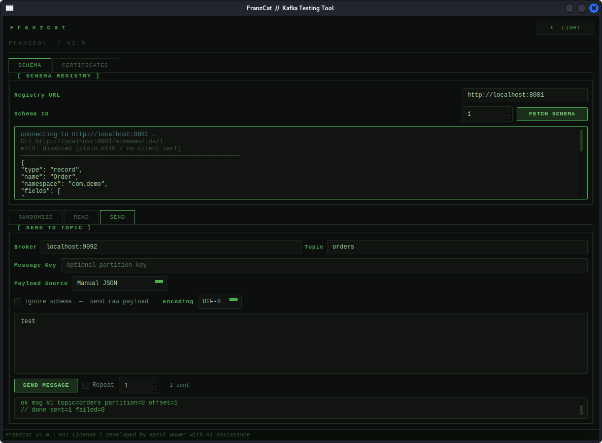
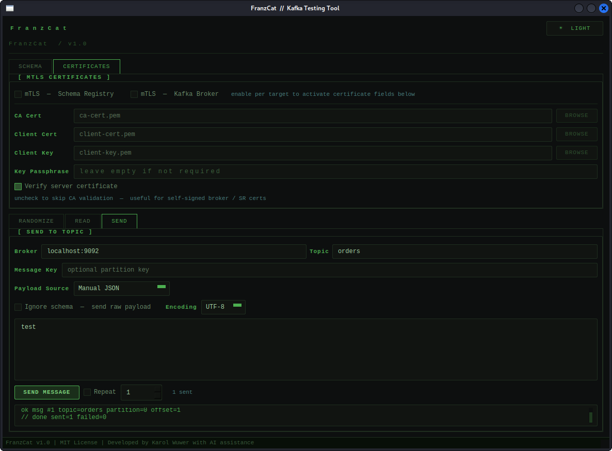
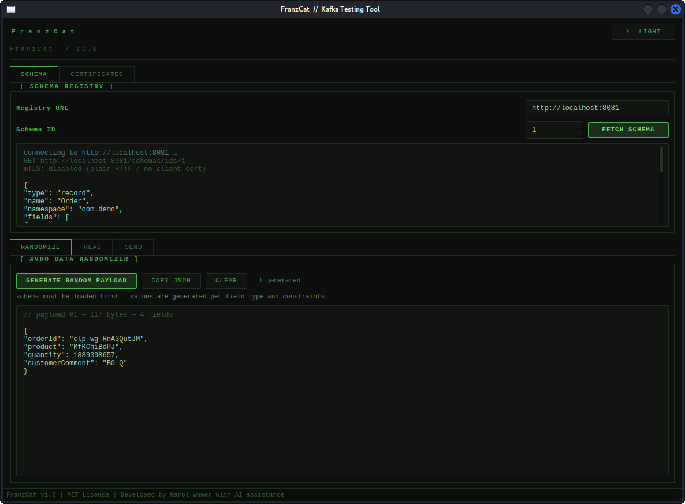
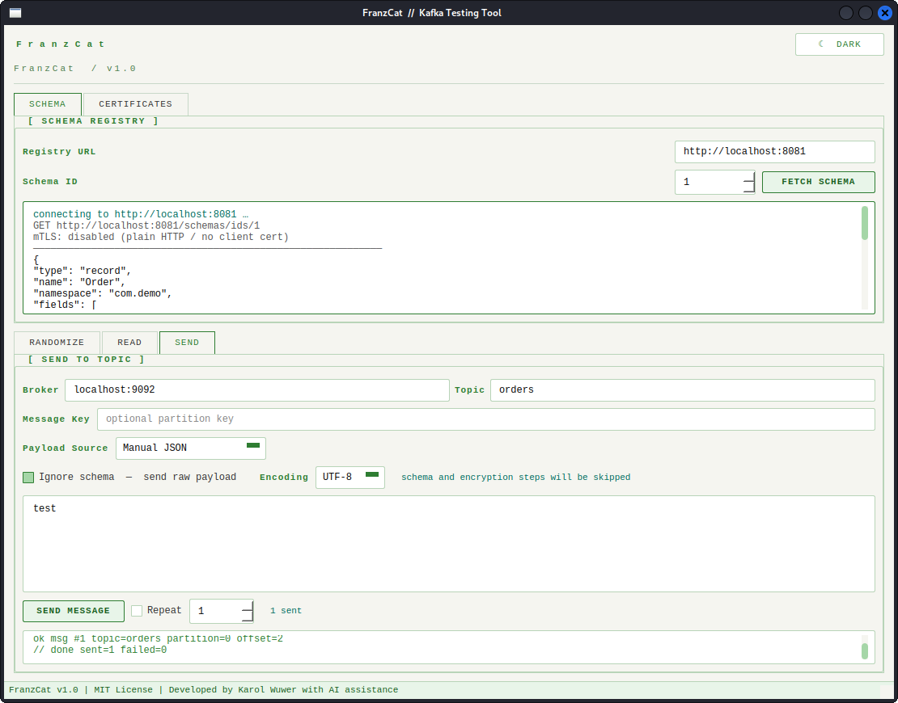

# 🐱 FranzCat

  

  

Kafka testing tool for developers, QA engineers, SREs, platform engineers, and security testers.

FranzCat provides a desktop interface for interacting with Kafka brokers and Confluent Schema Registry. It supports Avro schemas, payload generation, Kafka topics read and write operations, and mTLS connectivity.

---

# Features

## Schema Registry
 - Load schema by ID
 - Schema preview
 - Supports (m)TLS connections

## Paload Generation
 - Avro payload randomizer
 - Automatic generation based on loaded schema

## Topic Reading
 - Read from earliest/specific/latest offset
 - Message navigation
 - Raw payload inspection
 - Hex / Base64 view

## Topic Writing
 - Publish generated payloads
 - Manual JSON publishing
 - Raw payload mode

## Security
 - (m)TLS support
 - CA verification controls

 ---
 # Screenshots

 
 
 
 